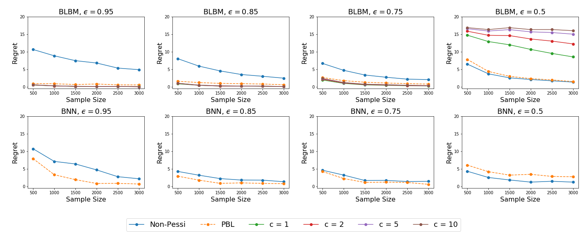
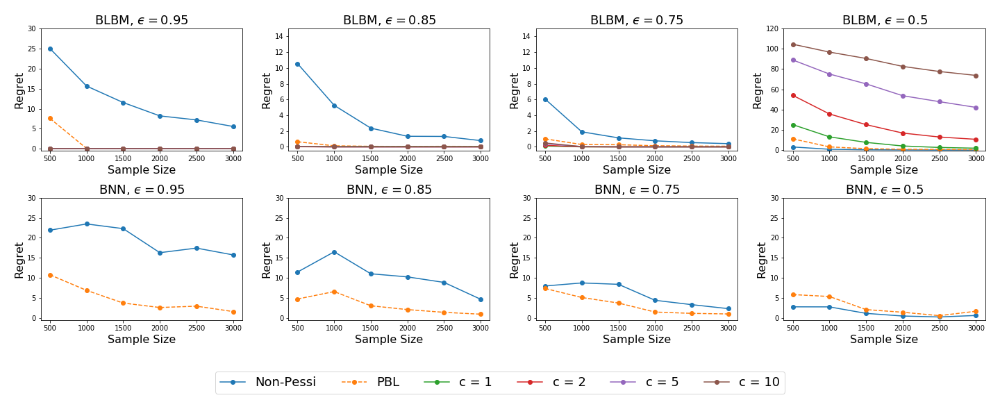
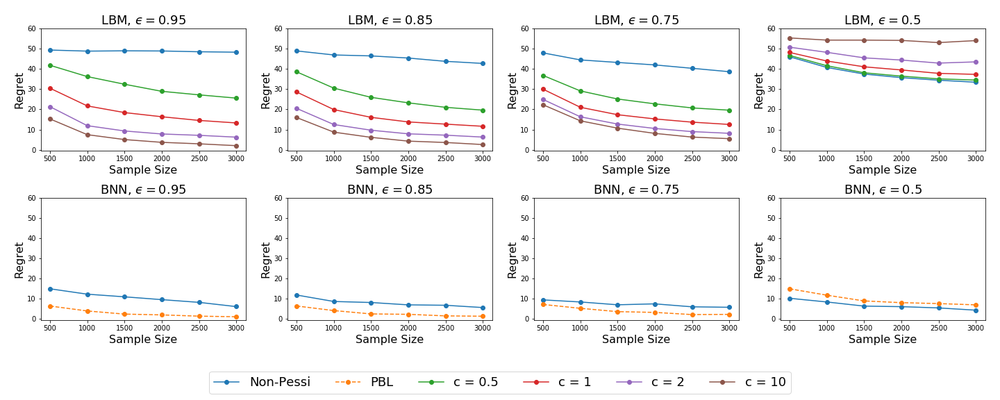
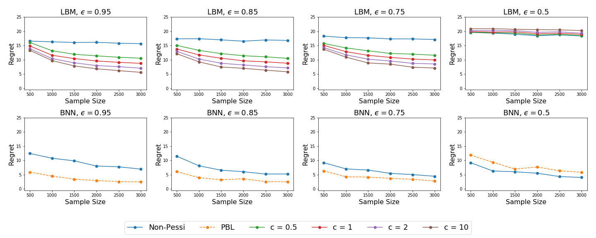
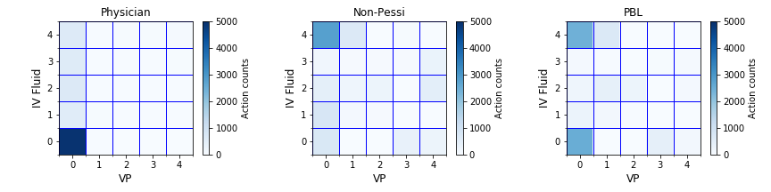
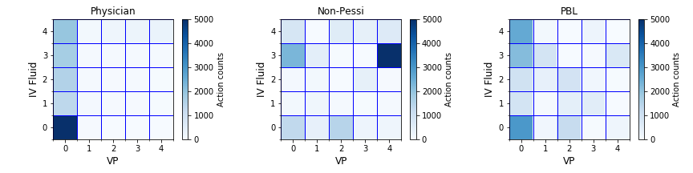

# Optimizing Pessimism in Dynamic Treatment Regimes: A Bayesian Learning Approach

This repository contains the implementation for the paper ["Optimizing Pessimism in Dynamic Treatment Regimes: A Bayesian Learning Approach"](https://openreview.net/pdf?id=8tABKfhBBpJ) in Python. 

## Summary of the paper

In this article, we propose a novel pessimism-based Bayesian learning method for optimal dynamic treatment regimes in the offline setting. When the coverage condition does not hold, which is common for offline data, the existing solutions would produce sub-optimal policies. The pessimism principle addresses this issue by discouraging recommendation of actions that are less explored conditioning on the state. However, nearly all pessimism-based methods rely on a key hyper-parameter that quantifies the degree of pessimism, and the performance of the methods can be highly sensitive to the choice of this parameter. We propose to integrate the pessimism principle with Thompson sampling and Bayesian machine learning for optimizing the degree of pessimism. We derive a credible set whose boundary uniformly lower bounds the optimal Q-function, and thus no longer require the tuning of the degree of pessimism. We develop a general Bayesian learning method that works with a range of models, from Bayesian linear basis model to Bayesian neural network model. We develop the computational algorithm based on variational inference, which is highly efficient and scalable. We establish the theoretical guarantees of the proposed method, and show empirically that it outperforms the existing state-of-the-art solutions through both simulations and a real data example. 

**Figures**:  

| Single Stage Linear | Single Stage Nonlinear | 
| :-------:    |  :-------: | 
|    |  |
| Two Stages Linear | Two Stages Nonlinear | 
|    |  |
| Single Stage Mimic III | Two Stages Mimic III | 
|    |  |
## Requirement

Use the following command to install the required dependencies: `pip install -r requirements.txt`.
+ Python 3.6
    + matplotlib==3.3.3
    + numpy==1.18.5
    + pandas==1.1.5
    + python-igraph==0.8.2
    + scikit-learn==0.23.2
    + scipy==1.5.4
    + sklearn==0.0
    + statsmodels==0.12.1
    + torch==1.0.0
    + xlwt==1.3.0

## File Overview
- `src/`: This folder contains all python codes used in numerical experiments and real data analysis.
  - `BayesBackpropagation.py` is the utils function for Bayesian neural network. (Refers to https://github.com/saxena-mayur/Weight-Uncertainty-in-Neural-Networks)
  - `toy_example.py` is the script to run for toy example.
  - `BLBM_linear_stage1.py` and `BLBM_nonlinear_stage1.py` are the scripts to run for BLBM in single stage. 
  - `BLBM_linear_stage2.py` and `BLBM_nonlinear_stage2.py` are the scripts to run for BLBM in two stages. 
  - `BNN_linear_stage1.py` and `BNN_nonlinear_stage1.py` are the scripts to run for BNN in single stage. 
  - `BNN_linear_stage2.py` and `BNN_nonlinear_stage2.py` are the scripts to run for BNN in two stages. 
  - `real_stage1.py` and `real_stage2.py` are for the Mimic III dataset.
- `data/`: This folder where the output results and the dataset should be put. It also includes the functions to generate the plots.
  - `plot_toy.py` generates plots for the results of toy example.
  - `plot_sim.py` generates plots for the results of simulations.
  - `plot_real.py` generates plots for the results of real dataset.
